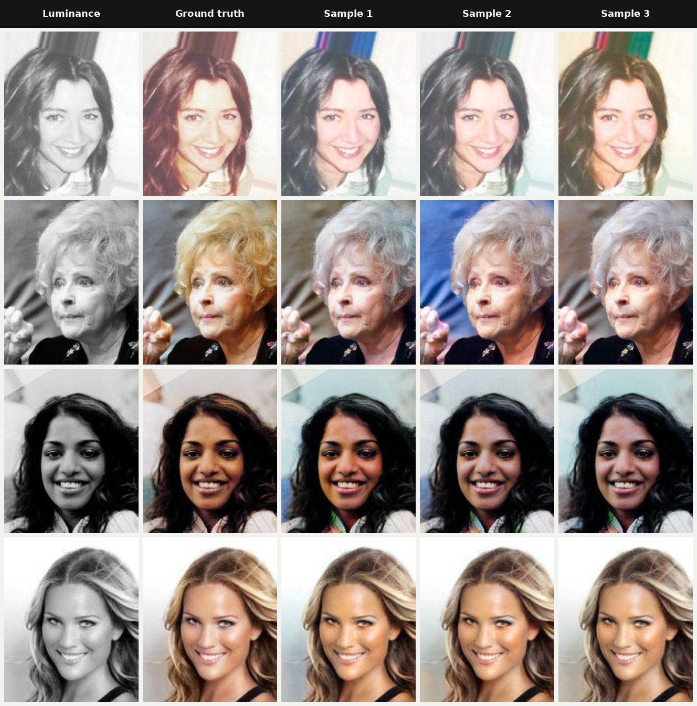
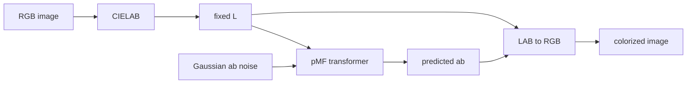

<div align="center">

# ColorMF

**One-step stochastic image colorization with Pixel Mean Flow**

[pMF paper](https://arxiv.org/abs/2601.22158) · [official implementation](https://github.com/Lyy-iiis/pMF) · PyTorch + Lightning

</div>



Each row uses one luminance image and three random seeds. The ground-truth color image is shown only for comparison; its chroma is never given to the model.

## What is ColorMF?

ColorMF adapts **Pixel Mean Flow (pMF)** from class-conditioned image generation to probabilistic colorization. Instead of conditioning on an ImageNet class, the transformer receives the black-and-white image as a spatial luminance channel. It generates the two missing CIELAB chroma channels, `a` and `b`.

The result is a compact conditional generative model with:

- **one network evaluation per sample**;
- **multiple plausible colorizations** from different random seeds;
- a fixed luminance path, so the model generates color rather than structure;
- no text encoder, VAE, diffusion schedule, or pretrained image generator.

The checkpoint used for the examples above was trained from scratch on **FFHQ at 64×64**. The displayed images are held-out **CelebA** examples. Inference runs at 64×64; for display, predicted chroma is resized to the source resolution and combined with the source-resolution luminance.

## Method

An RGB image is converted to CIELAB and split into luminance `L` and chroma `ab`. Only chroma belongs to the stochastic state:

$$
z_t = (1-t)\,ab + t\,\epsilon, \qquad \epsilon \sim \mathcal{N}(0,I).
$$

By default, the transformer sees the noisy chroma and fixed luminance together:

```text
network input = concat(z_t, L)
network output = two-channel chroma prediction
```

The model also supports dedicated luminance conditioning. Set
`model.conditioning.mode` to `separate` to embed `z_ab` and `L` with independent
bottleneck patch embedders, fuse their aligned spatial tokens residually, and
optionally reinject the projected luminance tokens before each transformer
block. `concat` is the default and remains compatible with existing checkpoints:

```yaml
model:
  conditioning:
    mode: concat  # concat | separate
    reinject: true
```

Training follows the pMF average-velocity objective and uses the auxiliary instantaneous-velocity branch for the JVP direction. At inference, sampling starts from Gaussian chroma noise at `t=1` and reaches a clean `ab` estimate in one forward pass. `L` is never noised, interpolated, or predicted.



## Quick Start

Create an environment and install the dependencies:

```bash
python -m venv .venv
source .venv/bin/activate
python -m pip install -r requirements.txt
```

Sample one image with a local checkpoint:

```bash
python sample.py \
  --config configs/pmf_t_64_colorization.yaml \
  --checkpoint checkpoints/pmf_t_4_64/last.ckpt \
  --input portrait.jpg \
  --output colorized.jpg \
  --seed 42 \
  --ema-variant 500
```

The model uses only the resized image's `L` channel. Change `--seed` to draw a different chroma sample while preserving the same luminance condition.

Checkpoints are not stored in this repository. Place downloaded or locally trained weights under `checkpoints/`, or pass any checkpoint path explicitly.

## Training

Manifests contain one image path per line. Relative paths are resolved beside the manifest, with a sibling `256/` directory supported for FFHQ-style layouts. Update the data paths and batch settings in a config, then run:

```bash
python train.py --config configs/pmf_t_64_colorization.yaml
```

The repository includes Tiny, Small, and pMF-B configurations. The B variants preserve the official 16×16 token geometry at 64, 128, and 256 pixels. Training supports Lightning DDP, BF16, Muon, EDM multi-EMA, MLflow logging, checkpoint resume, and optional LPIPS/ConvNeXt auxiliary losses.

Set `training.checkpoint_every_n_epochs` in the YAML config to control how often epoch checkpoints are written (for example, `5` saves every five epochs). It defaults to `1`; `last.ckpt` is updated on the same interval.

## CelebA Evaluation

`sample_celeba.py` reproduces the evaluation layout used above. It saves native 64×64 predictions and a second set where sampled `ab` is bicubically resized and combined with the original-size `L`:

```bash
python sample_celeba.py \
  --manifest /path/to/celeba.txt \
  --image-root /path/to/celeba/256 \
  --checkpoint checkpoints/pmf_t_4_64/last.ckpt \
  --count 20 \
  --sample-seeds 1 2 3 4 5
```

Generated evaluation folders are ignored by Git; keep only selected figures in `assets/`.

## Reference Fidelity

The implementation follows the official pMF formulation rather than replacing it with generic flow matching. In particular, it preserves:

- clean-endpoint to average-velocity conversion;
- the auxiliary instantaneous-velocity branch;
- JVP-based mean-flow consistency with fixed `L`;
- one-step `t=1 → r=0` sampling;
- the pMF transformer topology, RMSNorm, QK normalization, 2-D RoPE, SwiGLU, and time-prefix tokens.

The primary references are pinned in the source history:

- pMF JAX training/objective: [`Lyy-iiis/pMF@75f6073`](https://github.com/Lyy-iiis/pMF/tree/75f6073042c21f7104686261a0c4784db4ede9d1)
- pMF PyTorch architecture: [`Lyy-iiis/pMF@990e81a`](https://github.com/Lyy-iiis/pMF/tree/990e81a84249dbd68a128accef67eb95621d10b1)
- Improved Mean Flow: [arXiv:2512.02012](https://arxiv.org/abs/2512.02012)

## Tests

```bash
python -m pytest -q
```

The suite covers objective math, analytical JVP behavior, sampling determinism, LAB conversion, architecture geometry, EMA, Muon parity, perceptual losses, checkpointing, and distributed smoke execution.

## Acknowledgements

ColorMF is an adaptation of **Pixel Mean Flow** by the pMF authors. The generative method and core architecture originate in their paper and official repository; this project changes the task formulation to conditional CIELAB colorization and provides the PyTorch training and evaluation path used here.
